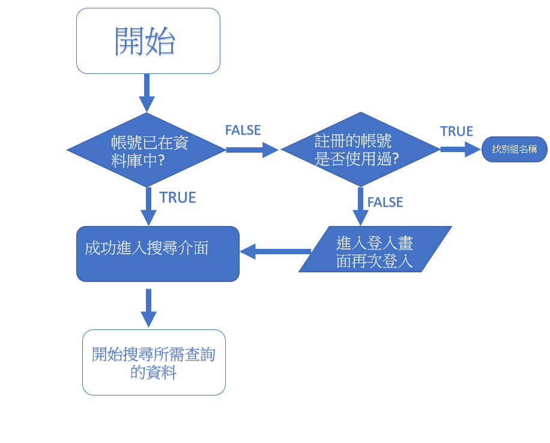
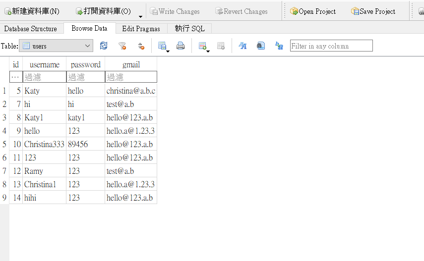

# 期末作業(前面)+期中作業(後面)(搜索引擎+login+signup 的功能)
* 網站的主題:搜尋引擎(只可搜尋維基百科英文版的資料)
* 作者:傅于軒
* 作品來源:並非100%原創
* 網頁連結[link](http://139.162.84.183:8000/public/searchh.html)
## 期末作業
### 前言
>* 原本目標是做完signup及login後能做出紀錄的功能
>* 現在是做完signup後能夠放入資料庫中，接者能夠login
>* 期中我就已經完成爬蟲+搜索引擎的基本搜尋功能(期中作業中會說明期中的)
>* 我期末學習了一點點linux的指令，並讓我的程式跑於我自己的linode中，未來期望能更熟悉linux的管理
>* 期末我增加了美觀及login/logout+signup的功能
>* 我是使用.ejs的方式來顯示我的畫面
>* 我增加了Fail.ejs用來表示登入錯誤；Same.ejs來表示註冊錯誤；searchResult2.ejs表示登入後所進入的介面
>* success.ejs表示我登入後成功的頁面,signupUi.ejs/loginUi.ejs表示登入登出一開始的介面

### login/signup
>* 這邊我是參考老師03-blogStatic來理解並做修改的
>* 我有做出登入成功的畫面
>* 和登入進去後能顯示User的名字
>* 學會了資料庫基本管理(新增+搜尋)
>* 更加了解了post和get的使用
>* get適合用於一般網頁查詢:因為會顯示傳回的網址，不適合應用於帳號密碼上
>* post用於帳號密碼上，不會顯示於網址上
* login/logout的流程圖


* 確實存入(使用者資料於資料庫中)資料庫中


### 我認為重要及學習到許多的程式碼部分
* 我用到了許多這個方式，主要是用來顯示另外一個畫面，而這些傳回的值，即作出相對應的動作，我寫在.ejs中
```
ctx.render('views/Fail.ejs')
```
* 這兩個分別是我登入前預設的地方
```
.get('/', (ctx)=>{
    ctx.response.redirect('/public/searchh.html')
  })

```
* 使用userQuery以下的這種寫法，在之後相同的資料庫查詢中能減少許多程式碼，相同資料庫只須直接使用userQuery來搜尋即可
```
function userQuery(sql){
  let list = []
  for (const [id,username,password,gmail] of sqlcmd(sql)) {
    list.push({id,username,password,gmail})
  }
  console.log('userQuery: list=', list)
  return list
}
```

## 期中作業
## 前言
>* 期中我完成爬蟲+搜索引擎的基本搜尋功能
>* 我學習到如何使用random於我的爬蟲中，讓他能夠每隔幾秒爬一次，讓壤業別發現我在爬他
>* 學習如何更改老師寫死的搜尋引擎，將其活用在elasticsearch上
>* 資料來源:參考老師上課所教+維基百科為搜索資料
>* 在main.js中我有做了基本排版

* 取亂數
```
 function sleep(ms) {
    return new Promise(resolve => setTimeout(resolve, ms));
}
for (var i = 0; i < 5; i++) { 
    await sleep(getRandomInt(5000));//delay random 0~5 秒才印出下一行
    console.log("Hello World");
}
```
* 得到關鍵字
```
  const query = ctx.request.url.searchParams.get('query')
  console.log('query =', query)
  let docs = await get('/web2/page/_search', {page:query})
```
* 搜尋<p>中的字，並將關鍵字中前後個字放入搜尋結果中
```
  for(var i=0;i<docs.length;i++){
    let s = ""
    let s1=""
    docs[i]["_title"]=""
    title1=parser.parseFromString(docs[i]["_source"]["page"],"text/html")
    title1.querySelectorAll('title').forEach((node)=>s1+=(node.textContent))
    docs[i]["_title"]=s1
    console.log("title=",s1)
    console.log(docs[i])
    document = parser.parseFromString(docs[i]["_source"]["page"],"text/html")//.querySelector('#mw-content-text')
    document.querySelectorAll('p').forEach((node)=>s += (node.textContent))
    var j=s.indexOf(query)
    docs[i]["_source"]["page"]=s.substring(j-150,j+150)
  }
```
* 在searchResult.ejs中這段是取出我所需要的那些字，印出
```
<ul id="posts">
  <% for (let doc of docs) { %>
    <li>
      <h2><a href="<%= doc._source.url %>"><%=doc._title%></a></h2>
      <p><%= doc._source.page.substring(0,300) %></p>
    </li>
  <% } %>
</ul>
```


 


